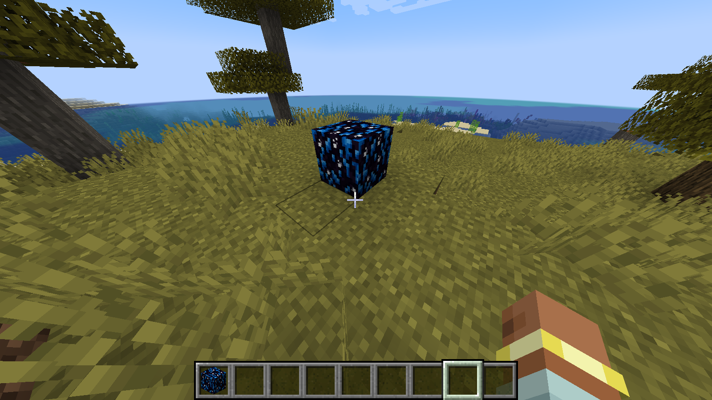
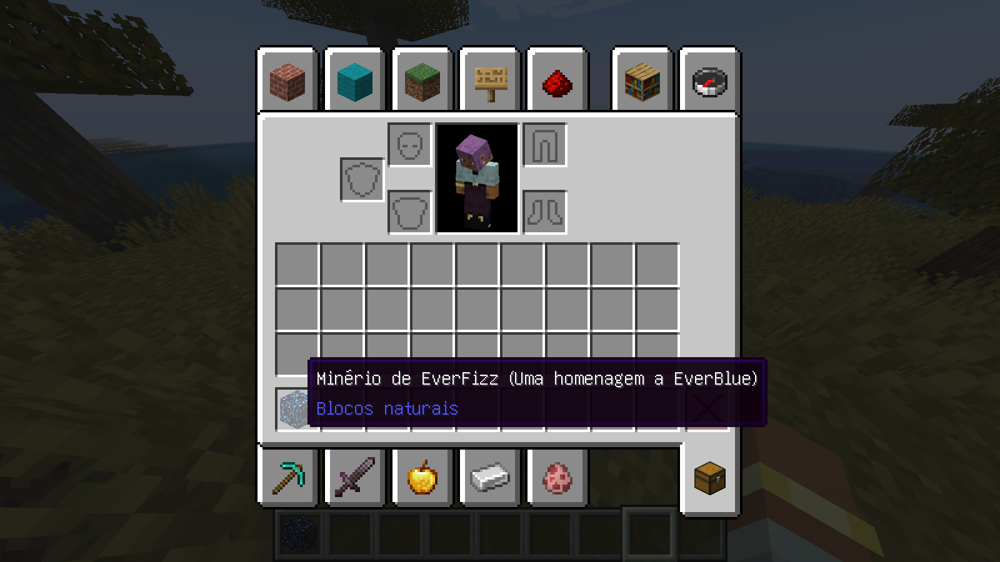

# 🎮 Meu Primeiro Projeto de Game Dev: EverFizz Mod

Este é o meu primeiro passo no mundo do desenvolvimento de jogos! Criei este mod de Minecraft como uma forma de aprender a lógica por trás dos games e também para fazer uma homenagem ao **EverBlue**.

### 📸 Visual do Minério no Jogo

Aqui estão as capturas de tela do meu progresso:

  
   
  

## 🛠️ Como eu fiz

O projeto foi construído do zero usando o ambiente do Minecraft Forge. Tive que aprender a lidar com uma estrutura rígida de pastas e arquivos de configuração (JSON) para que o jogo reconhecesse minha arte e meu código. 

## 🧠 O que eu aprendi

- **Lógica de Registro:** Como usar o Java para "avisar" ao motor do jogo que um novo objeto existe.
- **Mapeamento de Assets:** A relação entre o código Java e os modelos 3D em JSON.
- **Solução de Problemas:** Troubleshooting de erros de versão e caminhos de arquivos.

## 🧰 Ferramentas Utilizadas

- **Linguagem:** Java 21
- **IDE:** Visual Studio Code (VS Code)
- **API:** Minecraft Forge MDK 1.20.4